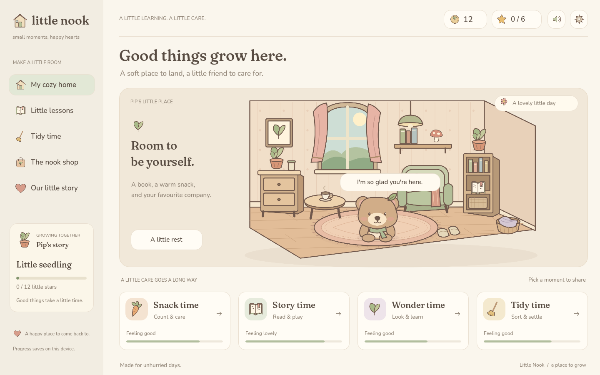
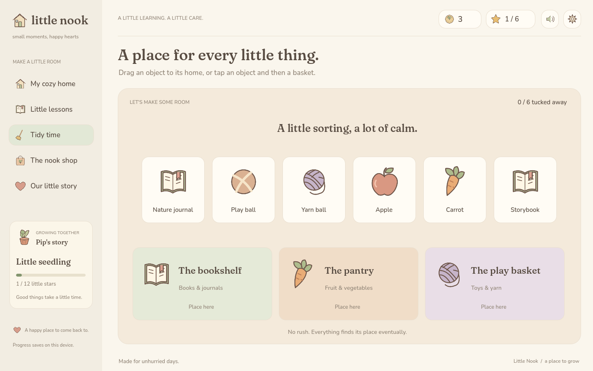
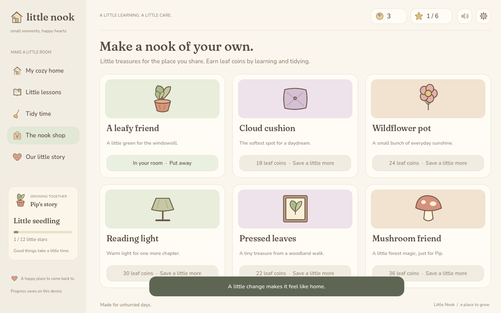

# Little Nook

[Check and build](https://github.com/carlos-aws/little-nook/actions/workflows/check.yml)

**A little learning. A little care. A home to grow into.**

**[Play in your browser](https://carlos-aws.github.io/little-nook/)**

A cozy Godot game about sharing small moments with Pip, a woodland bear.
Count a few apples, read a little story, discover something about nature,
then tuck everything back into its happy little home.



Original outlined illustrations, warm paper colours, a leafy little companion,
and gentle celesta sounds. Built with **Godot 4.7.2**, GDScript, and the
Compatibility renderer. No plugins, accounts, paid items, analytics, or server
backend.

## Play

On Linux, if a standalone build is present:

```bash
./play.sh
```

For development, install the standard **Godot 4.7.2** editor, import
`project.godot`, and press **F5**. The .NET version is not required.

```bash
godot --path .
```

The interface is designed for desktop and landscape tablets. Click or tap
buttons; drag objects in Tidy Time, or tap an object and then its destination.
**Tab** moves between controls, **Enter/Space** activates buttons, and **Esc**
goes back. Leaving an unfinished activity asks for confirmation.

## Small moments, real progress

| Moment | Activity | Care |
| --- | --- | --- |
| Snack time | Three maths questions: counting, addition, subtraction, groups | Food |
| Story time | Three English questions: sounds, words, sentences, grammar | Joy |
| Wonder time | Three science questions with gentle explanations | Curiosity |
| Tidy time | Sort six objects between a bookshelf, pantry, and play basket | Tidiness |
| A little rest | Let Pip rest, including while the game is closed | Energy |

- Wrong answers invite another try. After two misses, a hint highlights the
  answer. Every completed round still cares for Pip.
- Each activity earns a star, up to **six a day**, plus three leaf coins.
  Completing it without a miss adds two coins.
- Beyond the daily star goal, practice still gives care and one coin (plus
  the first-try bonus).
- Difficulty has three levels. Two perfect rounds advance that subject;
  an assisted round gently steps it back.
- Stars and time both matter for growth: 12 stars and 2 days in the first
  stage, then 36/5, 75/10, and 120/14. Growth happens when completing an
  activity after both requirements are met.
- Needs decrease slowly, never below 25%. Time away is capped at 48 hours
  when calculating changes. Rest restores 18 energy per hour, and a fully
  rested Pip wakes automatically.
- Daily stars reset on the next interaction after local midnight.

The Nook Shop has six original decorations. A purchase immediately places the
item in the room; you can put it away and place it again for free. The story
page records milestones, days visited, and moments shared.

The gear button opens the grown-ups' corner. Answer **7 × 6 = 42** to change
Pip's name, the daily goal (3, 6, or 9 stars), learning level, and animation.
The sound button is always available. Read-aloud uses your browser or an
installed English system voice; voices are not bundled.




## Saves

The game saves after rewards, shop changes, rest, preferences, every 30
seconds, and when pausing/closing. Each save is written to a temporary file
before replacing the active one. The last valid save is also kept as
`progress.json.bak`; it is recovered if the primary file is damaged.

Native saves use Godot's `user://` directory. On a default Linux installation:

```text
~/.local/share/Little Nook/progress.json
```

Copy that directory while the game is closed to make a manual backup.
Unrecoverable primary saves are preserved as `progress.json.corrupt`.
Browser saves use IndexedDB for the site's origin. Clearing site data,
private browsing, or moving to another domain can lose or separate progress.
Native and browser saves are independent.

This first version has one local companion and one room. Pixel Pals' multiple
profiles, AWS sign-in/sync, and import/export interface are not part of it.

## Browser export and offline play

Install the matching export templates through Godot's **Editor → Manage
Export Templates**, then:

```bash
./tools/export.sh Web
python3 tools/serve.py
```

Open **http://127.0.0.1:8081**. A Web export must be served over HTTP/HTTPS,
not opened as a local HTML file. It uses single-threaded WebAssembly and
WebGL 2, so ordinary static hosting is enough; cross-origin isolation headers
are not required.

The export includes a landscape PWA manifest and service worker. After a
complete first visit on localhost or HTTPS, the game can be installed and
loaded offline. Browser storage and service-worker support remain necessary.
The initial download includes approximately 38 MB of uncompressed engine
WebAssembly; static hosts can compress it.

To share on a local network, use `python3 tools/serve.py --bind 0.0.0.0`.
Offline installation needs HTTPS or localhost; plain HTTP on a LAN address
does not provide it.

For a native Linux executable:

```bash
./tools/export.sh Linux
./play.sh
```

Use `GODOT_BIN=/path/to/godot` with the scripts if Godot is not on your PATH.
Build products stay in the ignored `build/` directory.

## Development and verification

```bash
./tools/check.sh
```

This imports the project, runs pure game/content/save tests, and exercises
the UI's learning, retry, reward, tidy, shop, sleep, and settings flows.
Test saves and editor caches are isolated from player data. Tests use the
actual Godot runtime, with no third-party test framework.
See [the verification record](docs/verification.md) for the completed checks
and platform coverage.

To run the real Chromium/WebGL checks, first export Web and start the server:

```bash
node tools/browser_check.mjs
```

This optional check needs Node 22+ and Chromium on PATH. It uses Chromium's
debugging protocol directly, creates a temporary browser profile, checks
browser/offline boot, and captures the interaction screens in `tools/out/`.
Set `CHROMIUM_BIN` or `GAME_URL` if needed.

Regenerate editable SVG illustrations and the synthesized sounds:

```bash
python3 tools/make_art.py
godot --headless --path . --script tools/make_splash.gd
```

For a native screenshot without changing player progress:

```bash
godot --path . -- --demo --capture=/tmp/little-nook.png
godot --path . -- --demo --screen=shop --capture=/tmp/little-nook-shop.png
```

## Project layout

```text
project.godot              Engine configuration and entry point
scenes/main.tscn           Root scene
scripts/main.gd           UI, routing, animation, care interactions
scripts/nook_state.gd     Game rules, growth, economy, save validation
scripts/lessons.gd        Original questions and deterministic generators
scripts/save_store.gd     Atomic saves and backup recovery
scripts/tidy_item.gd      Draggable object, also usable by tap/keyboard
scripts/tidy_bin.gd       Native Godot drop destination
assets/art/              Original editable SVGs and derived boot PNG
assets/fonts/            Bundled OFL fonts and full notices
assets/audio/            Synthesized WAV effects
tests/                   Content, rules, persistence regression tests
tools/                   Art generation, checks, export, browser tooling
docs/                    Screenshots, design, and Pixel Pals analysis
.github/workflows/       Checks/build artifacts and automatic Pages publishing
```

See [the setup analysis](docs/pixel-pals-analysis.md) for the original game's
architecture and [the design notes](docs/design.md) for this game's direction.

## GitHub

Source: [carlos-aws/little-nook](https://github.com/carlos-aws/little-nook).

CI checks and exports both targets on pushes and pull requests.
The **Publish to GitHub Pages** workflow deploys the Web build whenever `main`
is updated. It can also be run manually from Actions to redeploy.

Live game: [carlos-aws.github.io/little-nook](https://carlos-aws.github.io/little-nook/).
Pages uses **GitHub Actions** as its publishing source.

Download browser and Linux builds from a successful run's artifacts in
**Actions → Check and build**. The game itself works independently of GitHub.

## License

Code, original art, and original audio: **MIT**. Nunito and Fraunces:
**SIL Open Font License 1.1**. See [THIRD_PARTY.md](THIRD_PARTY.md) for credits
and the Godot notices included with each export.
